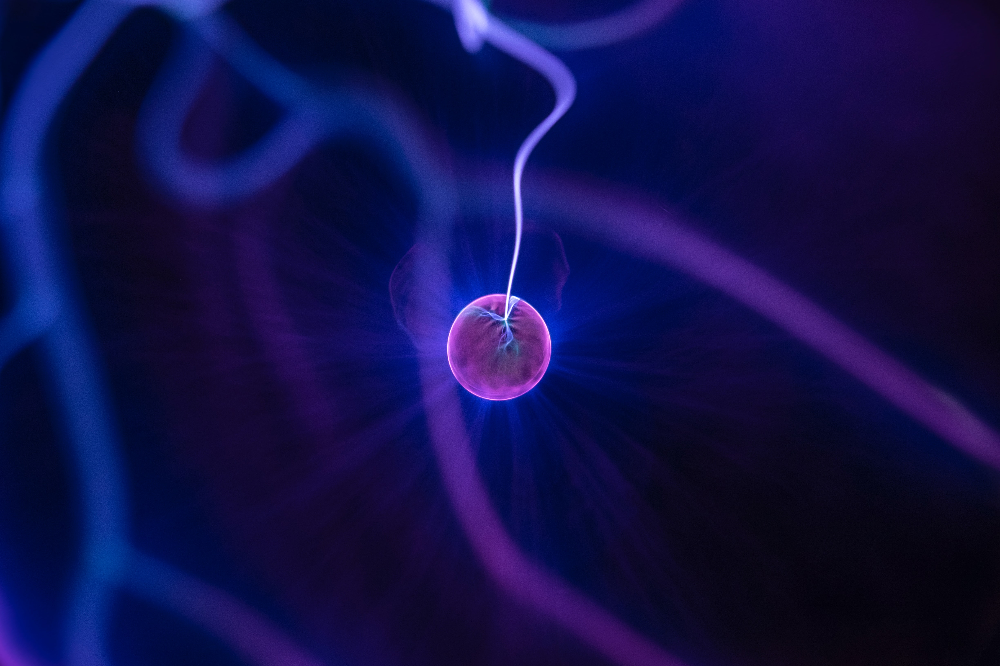

# Anger and Hunger
## Anger
Anger is a healthy emotion, and one that we then to feel, to one degree or another, on a daily basis. When someone is angry there are actual physical and mental changes taking places in your body. The occasional bout of anger is perfectly healthy. But if it's particularly intense, or you're perpetually upset, it can be detrimental. The effects on the body are very similar to those for people experiencing anxiety over the long-term. When the anger persists longer than that, these changes start to affect your all organs, digestion, sleep, mood, and the list goes on and on.

Anger is often responsible for letting us know when our boundaries have been crossed, when our values are at risk, or when we are not being true to ourselves. 

There are so many changes going on when we are angry that we literally become a different person - if only temporarily - if we are angry enough. Your heart rate will increase and your blood will start pumping to your head.

We reflexively position ourselves for battle for clenching fists, jaws, tightening our abdomen and core. We start seeing the world through a filter of anger and we may have a very difficult time actually understanding, hearing and interpreting other people. We become single focused and single purpose.

Among other effects, the body decides that it is simply not the time for digestion, and thus slows the process down.

Elevated [cortisol](https://www.webmd.com/a-to-z-guides/what-is-cortisol#1) kills neurons in the [hippocampus](https://www.britannica.com/science/hippocampus), which is where we create memories. This disrupts the creation of new memories and suppresses activity in the [hippocampus](https://www.britannica.com/science/hippocampus), which weakens short0term memory. It also prevents you from forming new memories properly. That's why highly stressful situation are harder to remember.

Too much [cortisol](https://www.webmd.com/a-to-z-guides/what-is-cortisol#1) will decreases [serotonin](https://www.healthline.com/health/mental-health/serotonin) - that's the hormone that makes you happy. A decrease in [serotonin](https://www.healthline.com/health/mental-health/serotonin) can make you feel anger and pain more easily, as well as increase aggressive behavior and lead to depression. Anger affects your immune system, the more stressed out and anger you are the more likely you are to get sick.

## Hunger

The need to find fuel to generate energy is a profound drive within the biology of all living organisms: we all need food to survive. So it's not surprising that our bodies have such a complex system to control food intake, driven by hormones.

Hormone levels also change when we lose weight. As much as we battle to trim down via diets and eating pattern, they're also the reason most of us will regain the weight we lose - or more.

The body;s system for regulating food intake is coordinated by the hypothalamus, which is located under the midline of the brain, behind the eyes.

The activity is mainly controlled by hormones that circulate in the blood. These come from tissues in various parts of the body that deal with energy intake and storage, including the gut (which receives and digests the food), the fat(which stores the energy) and pancreas(which makes hormones that are involved in energy storage, such as insulin).

*[Gherlin](https://www.yourhormones.info/hormones/ghrelin/)* is made in the stomach,Ti stimulates hunger by entering the brain and acting on the neurons in the hypothalamus to increase the activity of the hunger-causing nerve cells and reducing the activity of hunger-inhibiting cells.  

*[Cholecystokinin](https://www.yourhormones.info/hormones/Cholecystokinin/)* CKK is produced in the upper small bowl in response to food and gives a feeling of fullness. It is release soon after food reaches the small bowl,

The key part is that all the hormones then gradually return to their fasting levels three to four hours after a meal.

## Relation of Anger and Hunger

The carbohydrates, proteins and fats in everything you eat are digested into simple sugars such as glucose, amino acids and free fatty acids. The nutrients pass into blood stream from where they are distributed to your organs and tissues and used for energy.

As time passes after your last meal, the amount of these nutrients circulating in your bloodstream start to drop. if your blood-glucose levels fall far enough, your brain will perceive it as a life-threatening situation. you see, unlike most other organs and tissues in your body which can use a variety of nutrients to keep functioning, your brain is critically dependent on glucose to do its job.