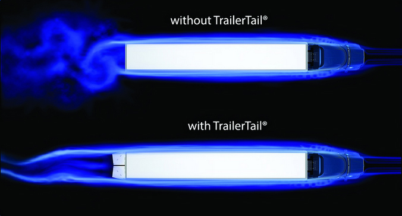
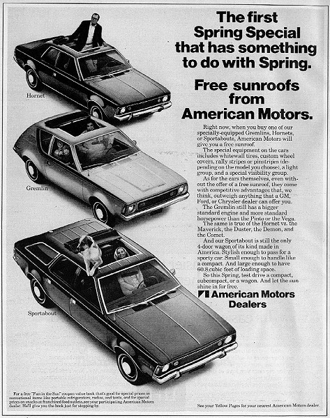
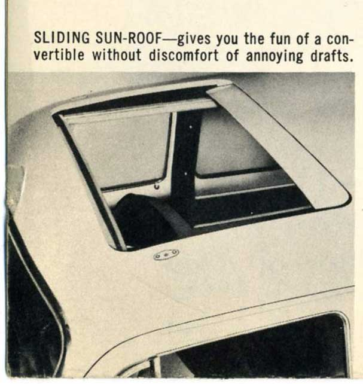

# Travel

- [Truck Aerodynamics](#Truck-Aerodynamics)
- [Sunroof vs Moonroof](#Sunroof-vs-Moonroof)


---
## Truck Aerodynamics
## Why do some semi-trucks have the wings on the back by the doors?

The relatively new device at the back of trailers are for improved aerodynamics that results in higher fuel economy.

Device mounted to the back of the trailer modify the airflow as it leaves the trailing edge of the side and top surface of the trailer. The flat back of the trailer is large contributor to the aerodynamic drag.



Boat tails, the most common of these devices, reduces the wake filed following the trailer, which can affect air some distance from the back of the trailer.

These devices typically stow flat against the rear-swinging door of a trailer. They deploy to their on-highway open position. A self-deploy feature has been incorporated into some designs that triggers a switch to open the tail at a predetermined highway speed.

### Major areas of aerodynamic drag


As a result in the united states, on-road freight is the fastest growing source of transportation related fuel consumption-$159 billion in 2012 and greenhouse gas emissions [1](truck_aerodynamics.md#Trailer-technologies-for-increased-heavy-duty-vehicle-efficiency) Aerodynamic drag accounts for 65% of the total drag on a Class8 truck with the remaining 35% attributes to the tires [2](truck_aerodynamics.md#At-highway-speeds-on-level-road)

As the trailer moves through the air, an area if low pressure forms directly behind the trailer creating separation and generating a turbulent airflow i.e, back pressure.

Object that allow for a laminar flow have muinimal drag, and therefore, is the most efficient shape.

#### Laminar Flow

```text
An object that allows for a laminar flow will have minimal drag, and therefore is the most efficient shape.
```

#### Turbulent Flow

```text
An object that creates turbulence in its wake is inefficient and has increased drag.
```

reference: -
* **Trailer technologies for increased heavy-duty vehicle efficiency.**
* **At highway speeds on level road.**

Links: -

* [Rocktail](https://rocketail.com/technology/)
* [Stemco](http://www.stemco.com/product/trailertail/)
* [NACFE](https://nacfe.org/technology/trailer-rear-devices/)

---

## Sunroof vs Moonroof
We have seen many mentioning sunroof and moonroof for the glass panel in the roof of the modern as well as some old car models. `What is the difference between a moonroof vs. a sunroof`

A sunroof was a term originally used to describe a metal panel that you could pop-up and remove or slide back. A moonroof is a term used to describe a see-through glass panel that could be opened by pushing a button.

The two terms are now used interchangeably. The big difference between the words sunroof and moonroof for most people now is the question about whether they slide open electrically. Technically the terms refer to the same thing.

The first sunroof was offered on a 1937 model Nash, a car company that was based in Kenosha, Wisconsin. The metal panel could be opened and slid back to let the sun and fresh air in. Nash built cars from 1916 till 1954.





`What is a panoramic moonroof?` A panoramic moonroof or a sunroof generally refers to a factory-installed roof system made up of fixed and sliding glass panels. It may be available as a standard feature or may be presented as an option.


